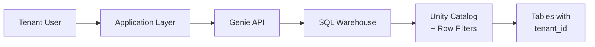
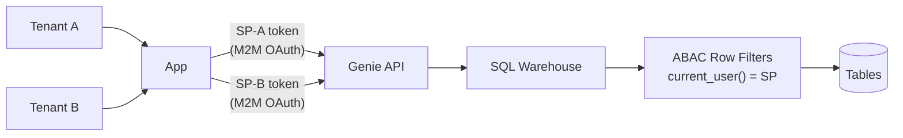
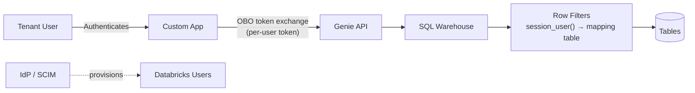
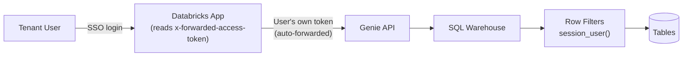
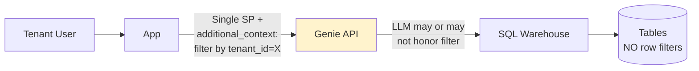

# Multi-Tenant Data Segregation for Databricks Genie

## Table of Contents

- [Problem Statement](#problem-statement)
- [Research Sources](#research-sources)
- [High-Level Architecture](#high-level-architecture)
- [Approaches Evaluated](#approaches-evaluated)
  - [A: SP-per-Tenant + ABAC (Recommended)](#approach-a)
  - [B: OBO OAuth + Row Filters](#approach-b)
  - [B2: Databricks App + Native OBO (Simplest)](#approach-b2)
  - [C: additional_context Param (UX Only)](#approach-c)
- [Decision Matrix](#decision-matrix)
- [Next Steps](#next-steps)
- [Key References](#key-references)

---

<a id="problem-statement"></a>


AirTies operates a multi-tenant Databricks workspace where all Unity Catalog tables contain a `tenant_id` column. Tenants and their sub-tenants (potentially hundreds) query data through Databricks Genie via an application layer.

The requirement is to guarantee that every Genie response only returns data belonging to the requesting tenant, filtered by `tenant_id`.

### Constraints

- **Single service principal**: One application identity calls Genie on behalf of all tenants. Identity-based row-level security cannot distinguish between tenants.
- **High tenant volume**: Hundreds of sub-tenants make a one-service-principal-per-tenant approach unmanageable.
- **No per-tenant infrastructure**: Duplicating Genie rooms, views, or service principals per tenant does not scale.

### Ruled-Out Approaches

| Approach                                                | Why It Fails                                           |
| ------------------------------------------------------- | ------------------------------------------------------ |
| One service principal per tenant                        | Hundreds of sub-tenants make this unmanageable         |
| One Genie room per tenant with pre-filtered views       | Does not scale with tenant volume                      |
| Unity Catalog row filters with `current_user()`         | Single SP means all tenants share the same identity    |
| Genie room instructions ("always filter by tenant_id")  | Relies on LLM compliance -- [not a security boundary](https://docs.google.com/document/d/15f98p8ygW9sjflSU6eMe-IdN8QL_g8bZvkQu1imNC2s/edit) |

---

<a id="research-sources"></a>


- Databricks official documentation ([AWS](https://docs.databricks.com/aws/en/), [Azure](https://learn.microsoft.com/en-us/azure/databricks/), [GCP](https://docs.databricks.com/gcp/en/))
- Josh Rosenberg, ["Embedding Genie API for a Multi-Tenant Application"](https://medium.com/dbsql-sme-engineering/embedding-genie-api-for-a-multi-tenant-application-d307bfbfc89b) (Medium, March 2026)
- [Genie Ready FAQ](https://docs.google.com/document/d/15f98p8ygW9sjflSU6eMe-IdN8QL_g8bZvkQu1imNC2s/edit) (internal Databricks document)
- [GenierAILS](https://github.com/databricks-solutions/genierails) open-source project
- Databricks blog: ["Access Genie Everywhere"](https://www.databricks.com/blog/access-genie-everywhere) -- OBO/U2M/M2M OAuth patterns
- [Unity Catalog ABAC](https://docs.databricks.com/aws/en/data-governance/unity-catalog/abac/) and [row filter](https://docs.databricks.com/aws/en/data-governance/unity-catalog/filters-and-masks/) documentation
- [Databricks Apps OBO user authorization](https://docs.databricks.com/aws/en/dev-tools/databricks-apps/auth) documentation
- Databricks community: [multi-tenant architecture](https://community.databricks.com/t5/community-articles/building-multitenant-architecture-on-databricks-platform/td-p/125937) articles

---

<a id="high-level-architecture"></a>




The core question is: **how does the Application Layer establish tenant identity so that Unity Catalog row filters can enforce isolation?**

---

<a id="approaches-evaluated"></a>


---

<a id="approach-a"></a>

###  

This is the pattern recommended by Databricks engineering ([Josh Rosenberg, March 2026](https://medium.com/dbsql-sme-engineering/embedding-genie-api-for-a-multi-tenant-application-d307bfbfc89b)).



**How it works:**

- Each tenant gets a dedicated service principal
- Genie API calls use that SP's OAuth M2M credentials
- Unity Catalog [ABAC row filters](https://docs.databricks.com/aws/en/data-governance/unity-catalog/abac/) evaluate `current_user()` at query time
- Since each SP is a distinct identity, ABAC automatically restricts data to that tenant's rows
- No application-level filtering needed -- Databricks handles isolation at the SQL execution layer

**Pros:**

- Databricks-recommended architecture
- Hard security boundary at the platform level
- Genie works fully: NL answers, SQL results, text summaries -- all tenant-scoped
- [ABAC policies inherit](https://docs.databricks.com/aws/en/data-governance/unity-catalog/abac/) down the object hierarchy (catalog -> schema -> table)
- [GenierAILS](https://github.com/databricks-solutions/genierails) provides this as code (ACLs, instructions, benchmarks, CI/CD)

**Cons:**

- Requires one SP per tenant
- With hundreds of sub-tenants, SP management overhead increases
- Needs automation for SP lifecycle (creation, rotation, cleanup)

**Assessment:** This is the gold standard. The concern about "hundreds of SPs" should be re-evaluated -- SP creation/management can be fully automated via Databricks Account API. Hundreds is well within operational limits. **If this is feasible, stop here.**

---

<a id="approach-b"></a>

### 



**How it works:**

- Provision each tenant/sub-tenant as a Databricks **user** (not SP) via SCIM or AIM
- Create a mapping table: `user_email` -> `tenant_id`
- Create [row filter functions](https://docs.databricks.com/aws/en/data-governance/unity-catalog/filters-and-masks/) using `session_user()` that look up the mapping table
- The application uses [On-Behalf-Of (OBO) OAuth](https://www.databricks.com/blog/access-genie-everywhere) to call Genie API with per-user tokens
- Genie executes queries with the [end user's data credentials](https://docs.databricks.com/aws/en/genie/set-up)
- Row filters fire automatically -- every result is tenant-scoped

**Row filter example:**

```sql
-- Mapping table
CREATE TABLE governance.security.user_tenant_map (
  user_email STRING,
  tenant_id  STRING
);

-- Row filter function (runs with definer's rights on mapping table,
-- but session_user() returns the invoker's identity)
CREATE FUNCTION governance.security.filter_by_tenant(tid STRING)
RETURN tid IN (
  SELECT tenant_id
  FROM governance.security.user_tenant_map
  WHERE user_email = session_user()
);

-- Apply to table
ALTER TABLE datalake_ireland_dev.ddm.dim_devices
SET ROW FILTER governance.security.filter_by_tenant ON (ext_tenant_id);
```

**OBO OAuth flow:**

```text
1. Tenant user authenticates to your app (your IdP)
2. Your app registers as OAuth app in Databricks Account Console
3. User grants your app permission -> Databricks returns auth code
4. Your backend exchanges auth code for user-specific access + refresh tokens
5. Backend creates a scoped WorkspaceClient with user's token:

   w = WorkspaceClient(host="https://...", token=user_access_token)
   message = w.genie.create_message_and_wait(
       space_id="<space-id>",
       conversation_id=conv.conversation_id,
       content="user question"
   )

6. Genie executes with user's data credentials -> row filters apply
7. Return results to tenant
```

**Pros:**

- Hard security boundary (UC row filters + per-user identity)
- Genie works fully (NL answers + SQL + results all tenant-scoped)
- Users scale better than SPs -- SCIM/AIM handles thousands
- Mapping table makes tenant assignment dynamic (update rows, not infra)
- [Row filter hybrid model](https://docs.databricks.com/aws/en/data-governance/unity-catalog/filters-and-masks/manually-apply): definer's rights on mapping table, invoker's identity for `session_user()`

**Cons:**

- Requires tenant users to exist in Databricks (SCIM/AIM provisioning)
- Requires tenant users to exist in your IdP (for OBO flow)
- OBO OAuth adds implementation complexity (token management, refresh)
- Each user needs CAN VIEW on Genie space + SELECT on UC data objects

**Assessment:** Best option if tenants can be provisioned as Databricks users. More scalable than SP-per-tenant for hundreds of sub-tenants.

---

<a id="approach-b2"></a>

###  

A variant of Approach B that eliminates custom OAuth plumbing by using Databricks Apps' [built-in user authorization](https://docs.databricks.com/aws/en/dev-tools/databricks-apps/auth).



**How it works:**

- Deploy the tenant-facing application as a **Databricks App**
- Enable **user authorization** on the app -- Databricks automatically [forwards the logged-in user's access token](https://community.databricks.com/t5/technical-blog/implement-fine-grained-permissions-for-databricks-apps-with-on/ba-p/116884) via HTTP headers
- The app extracts the token and creates a user-scoped WorkspaceClient to call Genie
- Row filters on tables enforce tenant isolation via `session_user()`
- No custom OAuth registration, no token exchange, no refresh token management

**Token forwarding example:**

```python
# In a Databricks App (e.g., Gradio, Streamlit, Flask)
from databricks.sdk import WorkspaceClient

def handle_query(request):
    # Databricks forwards the user's token automatically
    user_token = request.headers.get("x-forwarded-access-token")

    # Create user-scoped client
    w = WorkspaceClient(
        host="https://dbc-0d6ca8a5-c7ce.cloud.databricks.com",
        token=user_token
    )

    # Genie call runs with user's identity -> row filters apply
    message = w.genie.create_message_and_wait(
        space_id="<space-id>",
        conversation_id=conv.conversation_id,
        content=user_question
    )
    return message
```

**Pros:**

- All the benefits of Approach B
- No custom OAuth app registration or token exchange -- Databricks handles it
- Simpler implementation (just read the forwarded token header)
- App permissions control who can access the app, UC controls who sees what data

**Cons:**

- App must be deployed as a Databricks App (not an external standalone app)
- Tenant users still need Databricks identities (SCIM/AIM)
- Requires workspace with user authorization enabled (auto-enabled for compliance security profile)

**Assessment:** Simplest implementation path if the app can live inside Databricks Apps. Combines Approach B's security model with native platform integration. Eliminates the main complexity of Approach B (OAuth plumbing).

---

<a id="approach-c"></a>

###  



The Genie API accepts an `additional_context` field per message. You could inject: `"Only return data where tenant_id = 'X'"`.

**Problem:** This is an LLM instruction, not a security boundary. Genie may or may not honor it. Explicitly documented: ["Genie Spaces do not enforce a hard data boundary."](https://docs.google.com/document/d/15f98p8ygW9sjflSU6eMe-IdN8QL_g8bZvkQu1imNC2s/edit)

**Assessment:** Useful as a UX hint (guides SQL generation). Not a security mechanism.

---

<a id="decision-matrix"></a>


| Criteria                        | A: SP+ABAC      | B: OBO+Filters | B2: DBX App+OBO | C: Context Param |
| ------------------------------- | ---------------- | --------------- | ---------------- | ---------------- |
| Hard security boundary          | Yes              | Yes             | Yes              | No               |
| Genie NL answers tenant-scoped  | Yes              | Yes             | Yes              | No               |
| Scales to hundreds of tenants   | With automation  | Yes             | Yes              | Yes              |
| Custom code required            | Minimal          | Moderate        | Minimal          | Minimal          |
| Databricks-recommended          | Yes              | Partially       | Yes              | No               |
| Works with Genie                | Yes              | Yes             | Yes              | Partially        |
| App can live outside Databricks | Yes              | Yes             | No               | Yes              |

---

<a id="next-steps"></a>


1. **Validate SP scalability** -- Confirm whether AirTies can automate SP lifecycle for their tenant count. If yes, go with Approach A.
2. **If not** -- Evaluate whether tenant users can be provisioned via SCIM/AIM for Approach B or B2.
3. **Determine app hosting** -- If the app can be a Databricks App, B2 is the simplest path. If it must be external, Approach B with custom OBO OAuth.
4. **Read the Josh Rosenberg article** in full: "Embedding Genie API for a Multi-Tenant Application" (Medium, March 2026).
5. **Evaluate GenierAILS** (github.com/databricks-solutions/genierails) for infrastructure-as-code governance.
6. **Prototype** the chosen approach against the AirTies workspace with a test tenant.

---

<a id="key-references"></a>


- [Embedding Genie API for a Multi-Tenant Application](https://medium.com/dbsql-sme-engineering/embedding-genie-api-for-a-multi-tenant-application-d307bfbfc89b) -- Josh Rosenberg, March 2026
- [Access Genie Everywhere](https://www.databricks.com/blog/access-genie-everywhere) -- OBO/U2M/M2M OAuth patterns
- [Row filters and column masks](https://docs.databricks.com/aws/en/data-governance/unity-catalog/filters-and-masks/) -- UC row filter mechanics
- [ABAC in Unity Catalog](https://docs.databricks.com/aws/en/data-governance/unity-catalog/abac/) -- attribute-based access control
- [Use the Genie Spaces API](https://docs.databricks.com/aws/en/genie/conversation-api) -- conversation API reference
- [Configure authorization in a Databricks app](https://docs.databricks.com/aws/en/dev-tools/databricks-apps/auth) -- OBO token forwarding
- [Fine-grained permissions for Databricks Apps with OBO](https://community.databricks.com/t5/technical-blog/implement-fine-grained-permissions-for-databricks-apps-with-on/ba-p/116884) -- Databricks Community
- [GenierAILS](https://github.com/databricks-solutions/genierails) -- ABAC governance for Genie Spaces as code
- [Building MultiTenant Architecture on Databricks](https://community.databricks.com/t5/community-articles/building-multitenant-architecture-on-databricks-platform/td-p/125937) -- Databricks Community
- [Row and Column Level Security GA](https://www.databricks.com/blog/announcing-general-availability-row-and-column-level-security-databricks-unity-catalog) -- Databricks Blog
- [Best Practices for Genie Spaces](https://www.databricks.com/blog/data-dialogue-best-practices-guide-building-high-performing-genie-spaces) -- Databricks Blog
